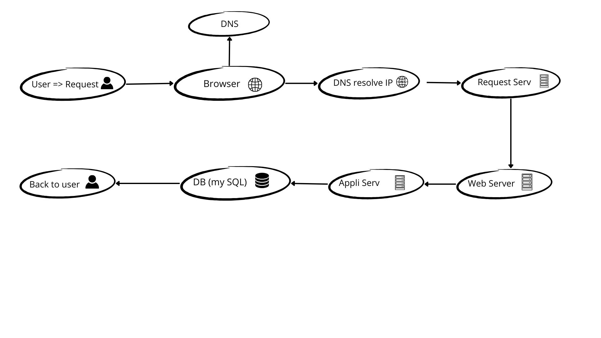

### **Explanation of Components**

1. **What is a server?**  
   A server is a physical or virtual machine that provides resources, services, or functionality to other devices or programs (clients). In this case, it hosts the website.

2. **What is the role of the domain name?**  
   The domain name (`foobar.com`) provides a human-readable address for users to access the website. It is translated into an IP address (`8.8.8.8`) via DNS.

3. **What type of DNS record is `www` in `www.foobar.com`?**  
   The `www` in `www.foobar.com` is a **CNAME record** (Canonical Name record) that points to the domain `foobar.com`, which in turn has an **A record** pointing to the server IP `8.8.8.8`.

4. **What is the role of the web server?**  
   The web server (Nginx) handles HTTP requests, serves static content, and forwards dynamic requests to the application server.

5. **What is the role of the application server?**  
   The application server runs the application code, processes business logic, and interacts with the database to generate dynamic content.

6. **What is the role of the database?**  
   The database (MySQL) stores and manages data required by the application, such as user information, posts, or transactions.

7. **What is the server using to communicate with the user's computer?**  
   The server communicates with the user's computer using the **HTTP/HTTPS protocol** over the internet.

---

### **Issues with This Infrastructure**

1. **SPOF (Single Point of Failure)**:  
   Since there is only one server, if it fails, the entire website becomes unavailable.

2. **Downtime during maintenance**:  
   Deploying new code or restarting the web server requires downtime, making the website temporarily inaccessible.

3. **Cannot scale for high traffic**:  
   A single server has limited resources (CPU, memory, bandwidth). If traffic increases significantly, the server may become overwhelmed, leading to slow performance or crashes.